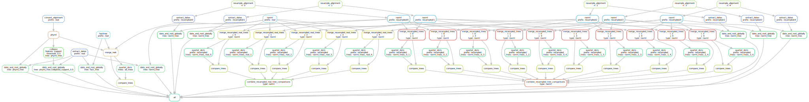
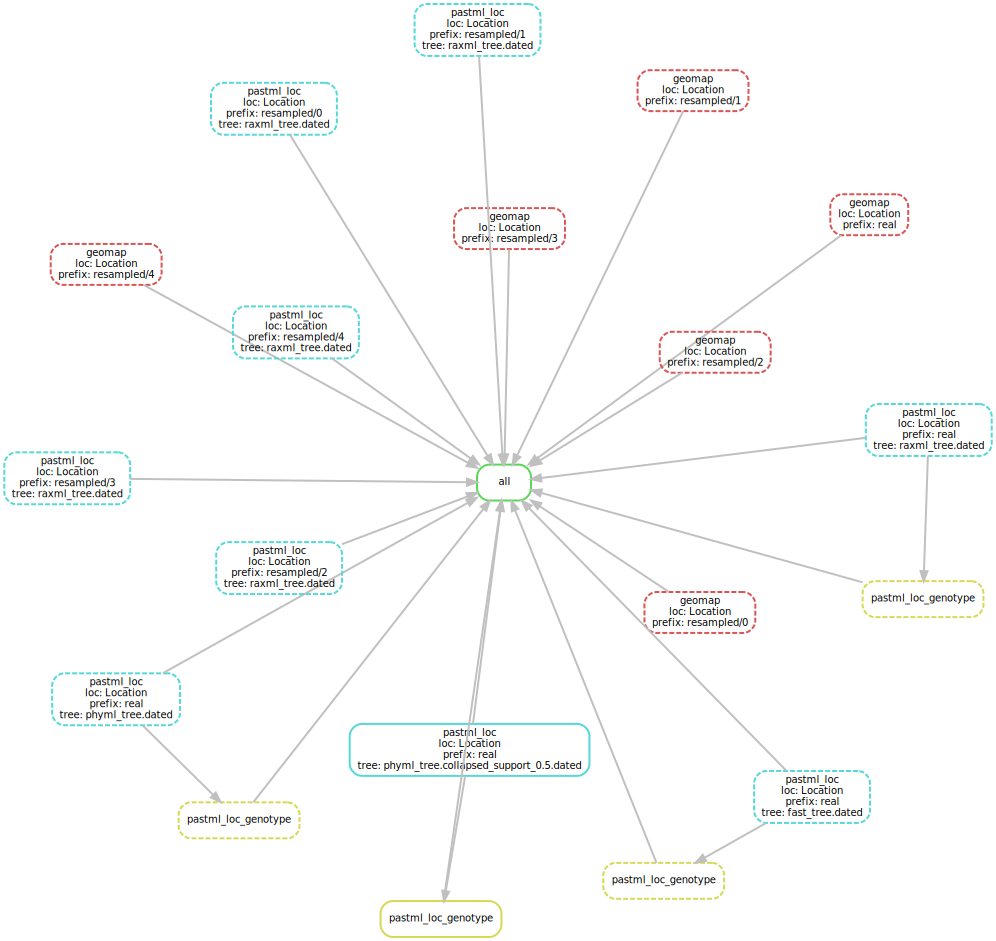

# Dengue serotype 2 (DENV2) epidemic

This folder contains Snakemake [[Köster *et al.*, 2012](https://doi.org/10.1093/bioinformatics/bts480)] pipelines and data 
needed for reconstruction of evolutionary history of Location of DENV2 epidemic, and assessment of its robustness.

### Data
We used a data set of 356 sequences, obtained from [[Ayres *et al.*, 2019]()]. 
This data set is annotated with sampling years (between 1944 and 2014), countries, 
that we grouped into 10 regions (Central America, Caribbean, South America, Europe, Africa, Western Asia, Eastern Asia, 
South-eastern Asia, and Oceania (including Australia)), 
and genotypes (13 sequences of Sylvatic lineage (isolated from humans, mosquitoes and sentinel monkey) 
and 343 sequences of 5 endemic genotypes: American, Asian-American, Asian I, Asian II, and Cosmopolitan). 

### Tree reconstruction
We reconstructed a maximum likelihood tree from the DNA sequences, 
then dated and rooted this tree (based on dates) using LSD [[To *et al.*, 2015](https://academic.oup.com/sysbio/article/65/1/82/2461506)]. 
To check the robustness of PastML inferences against phylogenetic uncertainty, 
the tree reconstruction was performed with 3 ML tools: RAxML [[Stamatakis, 2014](https://doi.org/10.1093/bioinformatics/btu033)], 
PhyML [[Guindon *et al.*, 2010](https://doi.org/10.1093/sysbio/syq010)] and FastTree [[Price *et al.*, 2010](https://doi.org/10.1371/journal.pone.0009490)], 
resulting in 3 trees with slightly different topologies (mean normalised RF distance of 0.107, normalised quartet distance 0.002). 

### Ancestral character reconstruction (ACR)
We reconstructed ACR for Location using PastML.

### Robustness of ACR

The 3 trees reconstructed with different ML tools and therefore with slightly different topologies 
were used to check the robustness of ACR against phylogenetic uncertainty.
We also checked the robustness of the results regarding state sampling variations. 
For this purpose we generated 5 new DENV2 alignments, 
each by picking 356 sequences randomly with replacement from the original alignment. 
This way we obtained 5 randomized alignments of the same size as the original one, 
but with some sequences removed and some present multiple times; 
which in turn slightly altered the numbers of samples per each location. 
We then reconstructed the trees as described above from these randomized alignments 
and compared their ACR of the Location.

## DIY

### Installing the dependencies
1. Install Snakemake workflow engine [[Köster and Rahmann, 2012](https://academic.oup.com/bioinformatics/article/28/19/2520/290322)] (version 5.4.0 or later), e.g. via pip3:
    ```bash
    pip3 install snakemake==5.4.0
    ```
2. Install Singularity [[singularity.lbl.gov](https://singularity.lbl.gov/)] (version 2.6.1).

### Running the pipelines
1. The tree reconstruction pipeline Snakefile_trees is avalable in the snakemake folder and can be rerun as (from the snakemake folder):
    ```bash
    snakemake --snakefile Snakefile_trees --keep-going --config folder=.. --use-singularity -singularity-args "--home ~"
    ```
    
    
    However, the resulting trees are already available in the data folder.
    
2. To perform ACR on the reconstructed trees, from the snakemake folder, run the Snakefile_acr pipeline:
    ```bash
    snakemake --snakefile Snakefile_acr --keep-going --config folder=.. --use-singularity --singularity-args "--home ~"
    ```
    