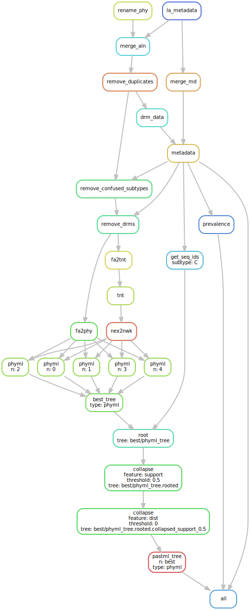
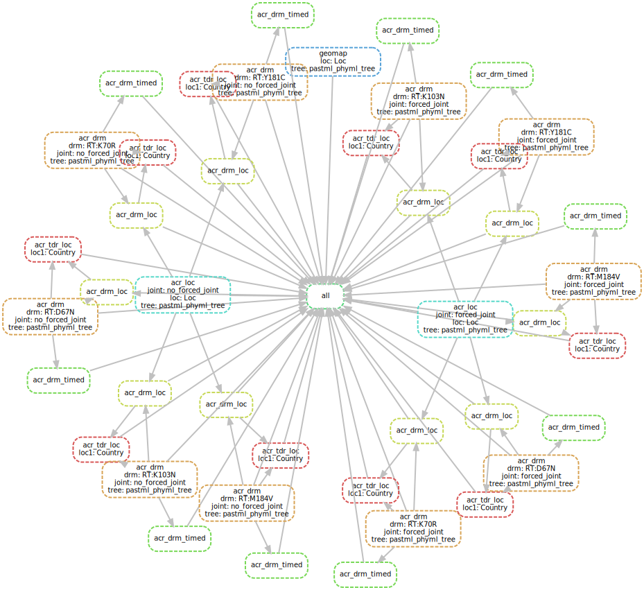

# HIV-1 subtype C epidemic

This folder contains a Snakemake [[Köster *et al.*, 2012](https://doi.org/10.1093/bioinformatics/bts480)] pipeline and data 
needed for reconstruction of evolutionary history of drug resistance mutations in HIV-1C epidemic.

The pipeline steps are detailed below.

### 1. Sequence alignment
This HIV-1C pol sequence data set is an update of the one used in the study by [Chevenet *et al.*, 2013](https://doi.org/10.1093/bioinformatics/btt010), 
which in turn updated the data from [Jung *et al.*, 2012](https://doi.org/10.1371/journal.pone.0033579).

We extended the alignment used by Chevenet *et al.* with HIV-1C pol sequences from the latest (2017) pol alignment in the Los Alamos HIV database [[Kuiken *et al.*, 2003](https://www.ncbi.nlm.nih.gov/pmc/articles/PMC2613779/)], 
hence adding 583 new sequence. Addition of the new sequences was performed using MAFFT multiple sequence alignment program with --add option [[Katoh *et al.*, 2013](http://doi.org/10.1093/molbev/mst010)]. 

The final alignment contains 3,619 HIV-1C pol sequences, plus 35 outgroup reference sequences from the non-C subtypes. 

### 2. Metadata
#### Sampling dates and regions
The data set of Chevenet *et al.* was annotated with sampling years 
and countries grouped into 11 regions: North America, Central America, South America, Europe, Asia, West Africa, 
the Horn of Africa, Central Africa, East Africa, Southern Africa excluding South Africa, and South Africa. 
Los Alamos alignment contained the information of the year and country of sampling. We combined them and updated the region information for the Los Alamos sequences to much Chevenet et al.
#### Surveillance Drug Resistance Mutations (SDRMs)
We detected SDRMs in the alignment, using the Sierra web service of the Stanford HIV drug resistance database [[Liu *et al.*, 2006](http://doi.org/10.1086/503914)]. 


### 3. Tree reconstruction

#### Reconstruction
We removed the SDRM positions from the alignment and reconstructed 5 most parsimonious trees using TNT 1.5 [[Goloboff *et al.*, 2016](https://doi.org/10.1111/cla.12160)], 
which were used as starting trees for 5 runs of PhyML 3.0 [[Guindon *et al.*, 2010](https://doi.org/10.1093/sysbio/syq010)] with GTR+I+Γ6 substitution model and aLRT SH-like branch supports. 
*(The PhyML reconstruction can be replaced with FastTree 2 [[Price *et al.*, 2010](https://doi.org/10.1371/journal.pone.0009490)] using the tree_types variable in the Snakefile_trees)*.
We thereby obtained 5 ML trees with different topologies. 
To assess the difference we calculated the average normalized bipartition distance = 0.33 (calculated with ETE 3 toolkit [[Huerta-Cepas *et al.*, 2016](http://doi.org/10.1093/molbev/msw046)]), 
and average quartet distance = 0.31 (calculated with tqDist library [[Sand *et al.*, 2014](http://doi.org/10.1093/bioinformatics/btu157)]), 
where 0.0 means identical trees, and 1.0 trees that have no bipartition / no quartet in common. 

We then chose the best tree (in terms of likelihood) to proceed.

#### Rooting
The resulting tree was rooted with the outgroup sequences, which were subsequently removed from the tree. 

#### Polytomies
The branches of length zero or aLRT SH-like support less than 0.5 were collapsed into polytomies. 


### 4. Ancestral character reconstruction (ACR)
We reconstructed ACR for Location and 5 most prevalent SDRMs using PastML (MPPA F81).

## DIY

### Installing the dependencies
1. Install Snakemake workflow engine [[Köster and Rahmann, 2012](https://academic.oup.com/bioinformatics/article/28/19/2520/290322)] (version 5.4.0 or later), e.g. via pip3:
    ```bash
    pip3 install snakemake==5.4.0
    ```
2. Install Singularity [[singularity.lbl.gov](https://singularity.lbl.gov/)] (version 2.6.1).
3. Install TNT 1.5 [[Goloboff *et al.*, 2016](https://doi.org/10.1111/cla.12160)] for generation of 5 most parsimonious starting trees 
*(only needed for regeneration of the trees)*.

### Running the pipelines
1. The tree reconstruction pipeline Snakefile_trees is avalable in the snakemake folder and can be rerun as (from the snakemake folder):
    ```bash
    snakemake --snakefile Snakefile_trees --keep-going --config folder=.. --use-singularity -singularity-args "--home ~"
    ```
    
    
    However, the resulting trees are already available in the data folder.
    
2. To perform ACR on the reconstructed trees, from the snakemake folder, run the Snakefile_acr pipeline:
    ```bash
    snakemake --snakefile Snakefile_acr --keep-going --config folder=.. --use-singularity --singularity-args "--home ~"
    ```
    

