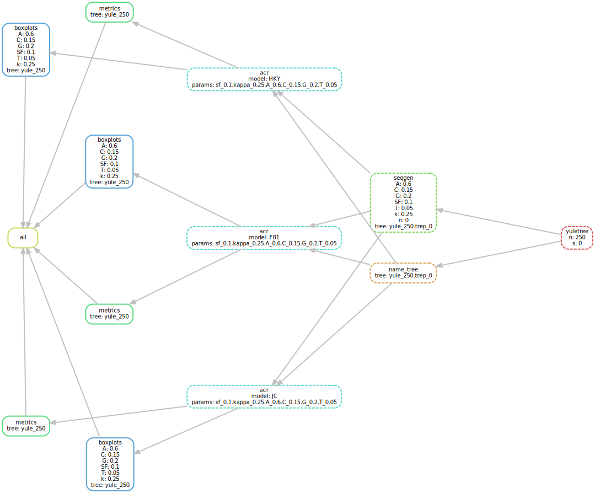

# Simulations

This folder contains Snakemake [[Köster *et al.*, 2012](https://doi.org/10.1093/bioinformatics/bts480)] 
for checking evoluttiionary model parameter estimation by PastML.

The pipeline consistas of 4 steps:

* generation of Yule tree topologies with 250 tips, then drawing branch lengths for them from an exponential distribution with mean 1 (x 10 times) -- this step is performed with _gotree_ [[Lemoine 2019]](https://github.com/fredericlemoine/gotree)    
* simulation of nucleotide character evolution along the tree with HKY model for all the combinations of the following parameters (x 10 times each combination on each tree) -- this step is performed with _Seq-Gen_ [[Rambaut and Grass 1997]](https://doi.org/10.1093/bioinformatics/13.3.235)
    * frequencies (A, C, G, T) = (0.6, 0.15, 0.2, 0.05) or (0.25, 0.25, 0.25, 0.25);
    * scaling factor 0.1, 0.5, or 1
    * kappa 0.25, 1, or 4
* estimation of model parameters with F81/JC/HKY with _PastML_
* calculation of  metrics and generation of boxplots for estimated values of each parameter set (each over 10 * 10 = 100 repetitions)

The boxplots show that each model performs fine in its correct setting (i.e. always for HKY; kappa=1 for F81; kappa=1 and A=C=G=T=0.25 for JC). 
When the setting is incorrect (e.g. kappa=4 or kappa=0.25), the models try to compensate by perturbing other parameters.


## DIY

### Installing the dependencies
1. Install Snakemake workflow engine [[Köster and Rahmann, 2012](https://academic.oup.com/bioinformatics/article/28/19/2520/290322)] (version 5.4.0 or later), e.g. via pip3:
    ```bash
    pip3 install snakemake==5.4.0
    ```
2. Install Singularity [[singularity.lbl.gov](https://singularity.lbl.gov/)] (version 2.6.1).

### Running the pipelines

From the snakemake folder, run the Snakefile pipeline:
    ```bash
    snakemake --keep-going --config folder=.. --use-singularity --singularity-args "--home ~"
    ```
    